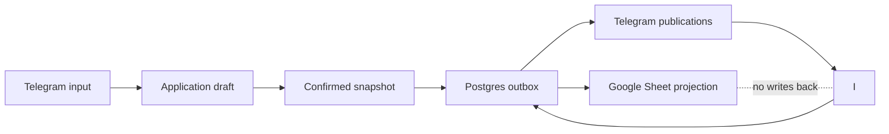
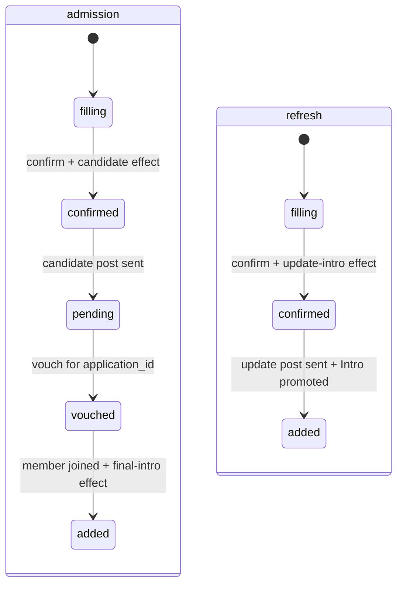
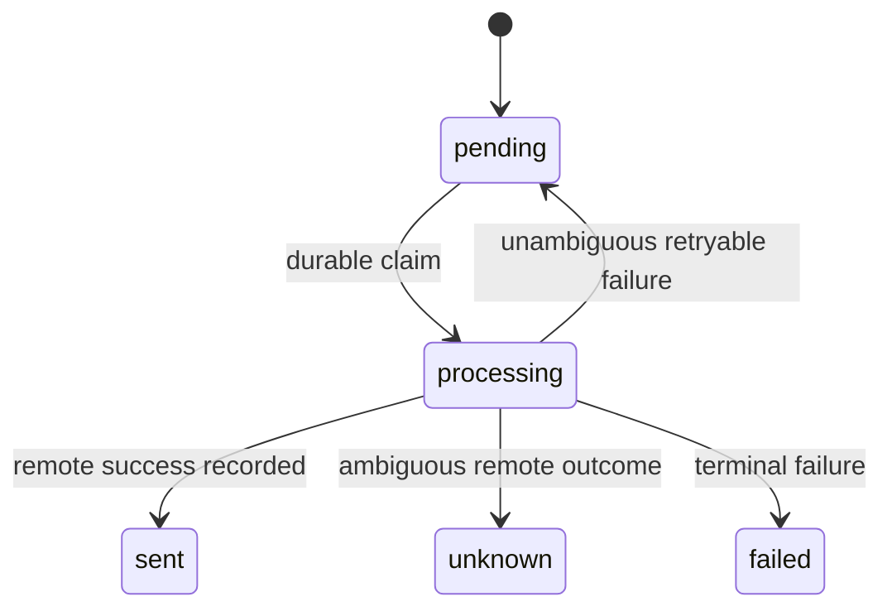
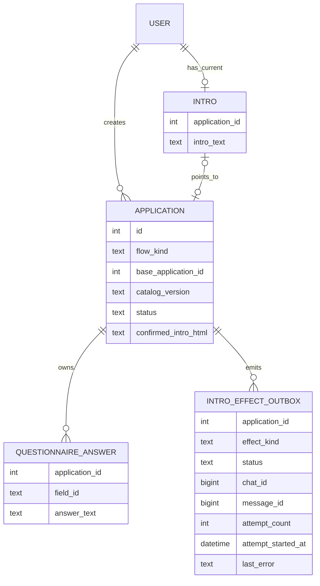

# Architecture Spine — Единый флоу интро Vibe Gatekeeper

## Design Paradigm

**Versioned Aggregate with Transactional Outbox and Unidirectional
Projections.** `Application` и её `QuestionnaireAnswer` образуют версию
анкеты. После подтверждения сохранённый пользовательский блок версии
неизменяем. `Intro` указывает на текущую опубликованную версию. Postgres-outbox
доставляет эффекты в Telegram и Google Sheet; эти поверхности не становятся
владельцами данных.

## Inherited Invariants

| Inherited | From parent | Binds here |
| --- | --- | --- |
| PostgreSQL — единственный источник истины | `docs/memory-system/decisions/0001-postgres-as-source-of-truth.md` | Ответы, версии, текущее интро |
| Derived-представление не становится каноническим | `docs/memory-system/decisions/0006-summary-as-derived-never-canonical.md` | Google Sheet и Telegram-render |
| DB + внешний эффект идут через Postgres-outbox | `docs/memory-system/decisions/0018-eventing-strategy-postgres-rows.md` | Telegram-публикации и Sheet-проекция |
| GitHub Issue — канонический ledger работы | `_bmad-output/project-context.md` | RFC #484 и будущие implementation stories |

## Invariants & Rules

### AD-1 — Версия анкеты ограничена одной Application [ADOPTED]

- **Binds:** CAP-1, CAP-2, CAP-6
- **Prevents:** смешивание ответов прежней и новой анкеты одного пользователя.
- **Rule:** Каждый read и write ответов после создания заявки содержит `application_id`; БД обеспечивает уникальность `(application_id, field_id)`, а выборка только по `user_id + is_current` запрещена для этого флоу.

### AD-2 — Один каталог полей

- **Binds:** CAP-1, CAP-4
- **Prevents:** независимый дрейф вопросов, подписей preview, сообщений и колонок Sheet.
- **Rule:** Стабильный `field_id`, вопрос, публичная подпись, порядок, нормализация и заголовок экспорта определяются в версионированном каталоге. Application фиксирует `catalog_version` при создании; версия остаётся доступной, пока на неё ссылается nonterminal application (`filling`, `confirmed`, `pending`, `vouched`, `privacy_block`), текущий `Intro` или незавершённый intro-effect.

### AD-3 — Подтверждение создаёт неизменяемый snapshot

- **Binds:** CAP-2, CAP-6
- **Prevents:** изменение опубликованного текста после preview, деплоя, задержки до вступления или смены шаблона.
- **Rule:** `confirmed_intro_html` — точный HTML-блок в порядке каталога, с `LF` между строками и HTML-escaped значениями. Digest — unpadded base64url первых 16 байт `SHA-256(UTF-8(confirmed_intro_html))`. Confirm несёт `application_id` и digest; одна транзакция проверяет status `filling`, digest и по одному ответу на обязательное поле, сохраняет HTML, переводит application в `confirmed` и создаёт первый outbox-эффект.

### AD-4 — Google Sheet только принимает проекцию [ADOPTED]

- **Binds:** CAP-2, CAP-5
- **Prevents:** rollback канонических ответов из устаревшей строки Sheet.
- **Rule:** Планировщик пишет в Sheet текущее подтверждённое состояние из PostgreSQL; код Sheet-sync не изменяет `QuestionnaireAnswer`, `Application` или `Intro`.

### AD-5 — Перепись публикуется до смены текущей версии

- **Binds:** CAP-3, CAP-5
- **Prevents:** потерю действующего интро при брошенном draft или ошибке Telegram.
- **Rule:** Confirm создаёт уникальный `(application_id, effect_kind)` в `intro_effect_outbox`. Worker фиксирует `processing`, `attempt_count` и `attempt_started_at` до IO. Reaper переводит просроченный `processing` в `unknown`, не повторяя отправку. После Telegram success одна транзакция записывает identity и условно переводит `Intro` с `base_application_id` на новую application.

### AD-6 — Downstream-действия привязаны к версии

- **Binds:** CAP-2, CAP-6
- **Prevents:** поручительство за одну редакцию и публикацию другой, а также обычные повторы после записанного успеха.
- **Rule:** Callback, vouch и effect несут `application_id`; identity публикации — `(application_id, effect_kind, chat_id, message_id)`. Успешный effect не повторяется. Неоднозначный Telegram timeout получает status `unknown`, блокирует слепой retry и требует reconciliation.

### AD-7 — Реферер уточняется монотонно

- **Binds:** CAP-4
- **Prevents:** потерю известной истории вступления при обычной переписи.
- **Rule:** Реферер читается только из application, на которую указывает текущий `Intro`. Общее значение копируется в draft и может быть заменено конкретным нормализованным `@username`; существующий конкретный ник переносится и не заменяется обычным refresh.

### AD-8 — Одна активная перепись

- **Binds:** CAP-3, CAP-6
- **Prevents:** гонку двух refresh-версий и продвижение устаревшей поверх новой.
- **Rule:** `Application` хранит `flow_kind` (`admission` или `refresh`) и `base_application_id`; partial unique constraint допускает для пользователя одну refresh-application в `filling` или `confirmed`, а повторный `/refresh` возобновляет её.

### AD-9 — Sheet следует за опубликованным Intro

- **Binds:** CAP-3, CAP-5
- **Prevents:** экспорт неподтверждённой, неопубликованной или уже устаревшей версии.
- **Rule:** Success-транзакция Telegram-интро продвигает `Intro` и создаёт Sheet-effect для той же application. Один APScheduler worker (`max_instances=1`) обрабатывает intro-effects последовательно; перед Sheet IO он проверяет текущий `Intro.application_id`, иначе завершает effect как stale.

### AD-10 — Legacy связывается только новой публикацией

- **Binds:** CAP-3, CAP-4, CAP-5
- **Prevents:** ложную привязку старого Intro к данным, уже изменённым Sheet-sync.
- **Rule:** Миграция добавляет nullable `Intro.application_id` и не делает эвристический backfill. Для `pending`/`vouched`/`privacy_block` индексы `0..6` маппятся в `name, location, referral, experience, projects, hardest, goals`, назначается `legacy-v1` и сохраняется application-scoped frozen HTML. У legacy `filling` прежние ответы выводятся из active-set, application переводится на `intro-v2` и при resume начинается с первого вопроса. Legacy-интро остаётся текущим до новой публикации. Участник без Intro идёт тем же refresh-flow, но получает заголовок «Интро».

## Consistency Conventions

| Concern | Convention |
| --- | --- |
| Identity | `application_id` — identity версии; `field_id` — identity поля; publication identity включает effect kind, chat ID и message ID |
| Mutation | Ответы изменяются только в `filling`; `confirmed_intro_html` append-only; `Intro` — указатель, а `Intro.intro_text` — только compatibility-проекция |
| Rendering | `parse_mode=HTML`; системный заголовок экранируется отдельно; сохранённый `confirmed_intro_html` не форматируется и не экранируется повторно |
| Errors | Unambiguous failure может retry; timeout и stale `processing` становятся `unknown`; operator либо записывает найденную Telegram identity, либо после доказанного отсутствия сбрасывает effect в `pending` |
| Export | Sheet-effect создаётся только после продвижения `Intro`; ошибки экспорта не блокируют Telegram-flow |
| Time | Все сохранённые timestamps — timezone-aware UTC |

## Stack

| Name | Version |
| --- | --- |
| Python | 3.12 |
| aiogram | 3.28.2 |
| SQLAlchemy | 2.0.49 |
| APScheduler | 3.11.2 |
| gspread | 6.0.2 |

## Structural Seed

Обязательны unique `(application_id, field_id)`, unique
`(application_id, effect_kind)` и partial unique для одной активной
refresh-application пользователя. Точные имена колонок определяет
implementation story.

## Capability → Architecture Map

| Capability / Area | Lives in | Governed by |
| --- | --- | --- |
| CAP-1 — единый контракт | Каталог полей и renderer | AD-2, rendering convention |
| CAP-2 — неизменяемая версия | Application aggregate | AD-1, AD-3 |
| CAP-3 — переписать себя | Refresh workflow, Intro pointer | AD-5 |
| CAP-4 — уточнение реферера | Refresh policy, normalizer | AD-2, AD-7 |
| CAP-5 — Sheet projection | Outbox worker, Sheets service | AD-4, AD-9 |
| CAP-6 — version-bound actions | Callback, vouch, outbox worker | AD-1, AD-3, AD-5, AD-6, AD-8 |

## Deferred

- Редактирование одного конкретного реферера на другого — до появления согласованной operator policy.
- Редактор отдельных полей — повторная анкета покрывает текущий сценарий.
- Автоматический retry эффекта со status `unknown` — operator reconciliation обязателен до появления надёжной Telegram lookup-механики.
- Миграция неоднозначных legacy-ответов — не угадывать; уточнять при следующей переписи.
- Root `SPEC.md` §5.3 описывает текущее двунаправленное поведение; implementation PR обязан заменить его правилом CAP-5/AD-4 одновременно с кодом.
- Deployment, environments, auth и privacy — наследуются без изменений из project context и существующей архитектуры.
