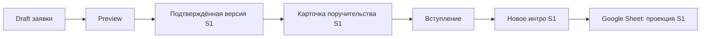
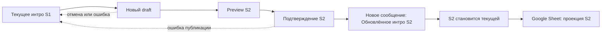

# Пользовательский контракт анкеты и интро

## Единый словарь полей

| ID | Вопрос пользователю | Подпись в preview, чате и Sheet |
| --- | --- | --- |
| `name` | Как тебя зовут? | 👤 Имя |
| `location` | Где ты проводишь большую часть года? | 📍 Основная локация |
| `referral` | От кого ты узнал о чате? Укажи `@username` или ссылку `t.me/username`. | 🔗 От кого узнал о чате |
| `experience` | Какой у тебя опыт с вайб-кодингом? | 💡 Опыт с вайб-кодингом |
| `projects` | Какие проекты и автоматизации ты реализовал с помощью вайб-кодинга? | 🚀 Проекты и автоматизации |
| `hardest` | Что самое сложное ты делал в вайб-кодинге за последнее время? | 🏋️ Самое сложное |
| `goals` | Что хочешь попробовать, изучить или лучше понять сейчас? | 🎯 Цели |

Публичные подписи и порядок едины для preview, карточки поручительства,
финального интро, обновлённого интро и Google Sheet. Системные заголовки могут
различаться; пользовательский блок — нет.

Каталог имеет стабильную версию `intro-v2`. Application запоминает её при
создании и использует до завершения, даже если для новых анкет уже появился
следующий каталог.

## Новый участник



Поручительство хранит идентификатор S1. Изменение анкеты создаёт другую версию;
кнопка от S1 не может подтвердить её.

## Переписать себя



Прежнее сообщение не редактируется и не удаляется. Незавершённый draft можно
продолжить; повторный `/refresh` открывает тот же draft. До успешной публикации
S2 текущей остаётся S1.

## Уточнение реферера

- Если сохранён конкретный `@username`, поле переносится в новую версию и не задаётся повторно.
- Если сохранено общее значение вроде «От участника чата», бот задаёт вопрос заново.
- `nickname` и `t.me/nickname` нормализуются в `@nickname` до preview.
- Замена одного конкретного ника другим требует отдельного процесса исправления истории и не входит в обычную перепись.

## Формат сообщений

Каждая поверхность добавляет собственный системный заголовок к одному
сохранённому пользовательскому блоку:

```text
Preview                   = инструкция проверить + пользовательский блок S1
Карточка поручительства   = заголовок новой анкеты + пользовательский блок S1
Интро после вступления    = заголовок нового участника + пользовательский блок S1
Обновлённое интро         = заголовок обновления + пользовательский блок S2
```

После подтверждения пользовательский блок не перерендеривается из «текущих»
ответов и не меняется из Google Sheet.

Legacy-интро без ссылки на application остаётся действующим до переписи. Бот
задаёт все вопросы заново и не пытается восстановить поля из Sheet или старого
текста. Для участника без интро тот же flow публикует заголовок «Интро», а не
«Обновлённое интро».

Незавершённые drafts старого формата после миграции также начинаются заново:
неподтверждённые значения могли быть уже изменены прежним Sheet-sync.
